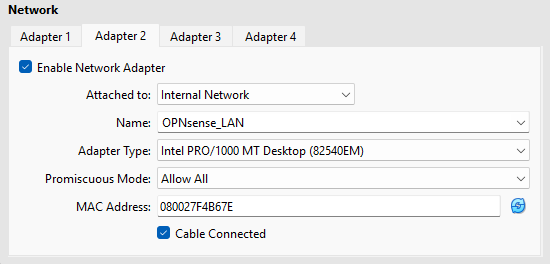

# Part 1 – Infrastructure Setup

## Description

Part 1 establishes the foundation of the SOC-in-a-Box Homelab by implementing correct segmentation, switching behavior, and firewall placement.

This phase focuses on building a stable base that behaves like a real environment:
- clean WAN/LAN separation
- predictable VLAN behavior (trunk vs access)
- firewall routing and DHCP boundaries
- virtualization settings that persist across reboots

This phase also documents the real troubleshooting steps required to reach a stable design.

---

## Goals

- Establish VLAN-based segmentation on the router and managed switch
- Ensure correct trunk vs access port behavior
- Stand up OPNsense as the perimeter firewall in a virtualized environment
- Validate WAN DHCP and internal LAN addressing
- Confirm persistence (no config loss on reboot)
- Prepare the lab for Part 2 network segmentation and firewall policy enforcement
- Prepare the SOC services host (Proxmox) for Part 3 SIEM deployment and log ingestion

---

## Architecture (Part 1 Scope)

- Router: UCG-Ultra (VLANs defined here)
- Switch: Managed switch enforcing VLAN trunk/access roles
- Firewall: OPNsense in VirtualBox on the Main Homelab Workstation (System 2)
- SOC Host: Proxmox Server reserved for Wazuh and SOC services (Part 3)

---

## VLANs and Networks

Exact VLAN IDs and subnets are documented here for reproducibility.
(Main project README stays high-level.)

### VLAN List (Confirmed)
- VLAN 1 – Home / Management: 192.168.1.0/24 (GW 192.168.1.1)
- VLAN 10 – Lab Ingress (Firewall WAN): 192.168.10.0/24 (GW 192.168.10.1)
- VLAN 20 – Internal Lab (Firewall LAN): 192.168.20.0/24 (GW 192.168.20.1)
- VLAN 30 – Cyber Range / Targets: 192.168.30.0/24 (planned)
- VLAN 40 – Windows / AD Lab: 192.168.40.0/24 (planned)
- VLAN 50 – Security / SOC Services: 192.168.50.0/24 (planned)

### DHCP
- VLAN 1 DHCP source: UCG-Ultra (default LAN DHCP)
- VLAN 10 DHCP source: UCG-Ultra (Lab VLAN DHCP enabled)
- VLAN 20 DHCP source: OPNsense (LAN-side DHCP enabled)
- VLANs 30/40/50 DHCP strategy: planned (segmented routing + policy enforced in Part 2)

---

## Switch Port Roles

Show switch screenshots (VLAN membership)

### Uplink Port to Router (Trunk)
- Port: 1
- VLAN 1: Untagged (native)
- VLANs 10/20/30/40/50: Tagged
- PVID: 1

### Workstation Second NIC (Access Port for Lab Ingress)
- Port: 7
- VLAN 10: Untagged
- VLAN 1: Not untagged
- PVID: 10

### Workstation Primary NIC (Home / Management)
- Port: 3 (home access port)
- VLAN 1: Untagged
- PVID: 1

### Notes
- End devices must be untagged on one VLAN (access) unless the endpoint is VLAN-aware
- Incorrect uplink tagging caused VLAN leakage and incorrect DHCP behavior (192.168.1.x symptom)
- Correct model: VLAN 1 untagged on uplink, lab VLANs tagged on uplink

---

## OPNsense VirtualBox Deployment

Show VirtualBox screenshots (Adapters + Storage)

### VM Hardware (Required for Stability)
- Disk Controller: SATA (AHCI)
- Disk Size: 32 GB (recommended for stability)
- Why: IDE controller caused filesystem read-only state and config loss on reboot

### Installation Mode (Important)
To install to disk from ISO:
- login: installer
- password: opnsense

Logging in as root boots Live Mode (no disk install, no persistence).

---

## OPNsense Network Interfaces

### Adapter Layout
- Adapter 1 (WAN): Bridged Adapter → Workstation second NIC (connected to Switch Port 7 on VLAN 10 access)
- Adapter 2 (LAN): Internal Network → OPNsense_lan

### Interface Assignment (OPNsense)
- WAN → vtnet0
- LAN → vtnet1

### LAN Addressing (Configured)
- LAN IP: 192.168.20.1/24
- DHCP on LAN: Enabled
- DHCP range: 192.168.20.100 – 192.168.20.200

---

## Validation Checklist

### VLAN / DHCP Validation
- Workstation second NIC is isolated to VLAN 10 (port 7 access behavior)
- OPNsense WAN receives a 192.168.10.x IP from VLAN 10 DHCP (GW 192.168.10.1)
- OPNsense LAN is static at 192.168.20.1 and does not pull from VLAN 1

### Persistence Validation (Critical)
- Reboot OPNsense VM
- Confirm:
  - interface assignments remain correct (WAN vtnet0 / LAN vtnet1)
  - LAN IP remains 192.168.20.1
  - settings persist across reboot

### Test VM Validation
- Attach a test VM to Internal Network: OPNsense_lan
- Confirm:
  - receives 192.168.20.x via DHCP
  - can ping 192.168.20.1
  - routes through OPNsense as designed

---

## Troubleshooting Highlights (What Was Solved)

### Issue 1: Devices always pulled 192.168.1.x
Symptoms
- Workstation second NIC repeatedly received 192.168.1.x
- Firewall WAN received 192.168.1.x

Root Cause
- Switch uplink tagging was inverted:
  - VLAN 10 was not being carried correctly
  - VLAN 1 was mis-tagged/untagged on the uplink

Fix
- Uplink port corrected to:
  - VLAN 1 untagged
  - VLAN 10 tagged
  - PVID 1
- Port 7 corrected to:
  - VLAN 10 untagged
  - PVID 10

---

### Issue 2: OPNsense settings would not persist
Symptoms
- Settings reverted after reboot
- Disk showed 100% usage
- Filesystem mounted read-only

Root Cause
- VM disk attached to IDE controller (unstable for this build)
- Earlier attempts used root (Live Mode) instead of installer (disk install)

Fix
- Rebuilt OPNsense VM using SATA controller and adequate disk size
- Installed to disk via installer user
- Removed ISO after install and ensured boot order favored Hard Disk

---

## Outcome of Part 1

By the end of Part 1:
- VLAN behavior is predictable and correct
- OPNsense is installed to disk and stable
- WAN/LAN separation is verified
- Internal lab network (VLAN 20) is stable and ready for segmentation enforcement in Part 2

---

## Next: Part 2 – Network Segmentation & Firewall Policy

Part 2 will focus on:
- Building segmentation between internal lab VLANs (30/40/50)
- Creating OPNsense firewall rules for controlled inter-VLAN access
- Connecting VirtualBox VMs to the correct VLANs/networks
- Validating routing, DNS, and reachability per segment

Part 3 will then deploy Wazuh on Proxmox and validate SIEM log ingestion from firewall and endpoints.
