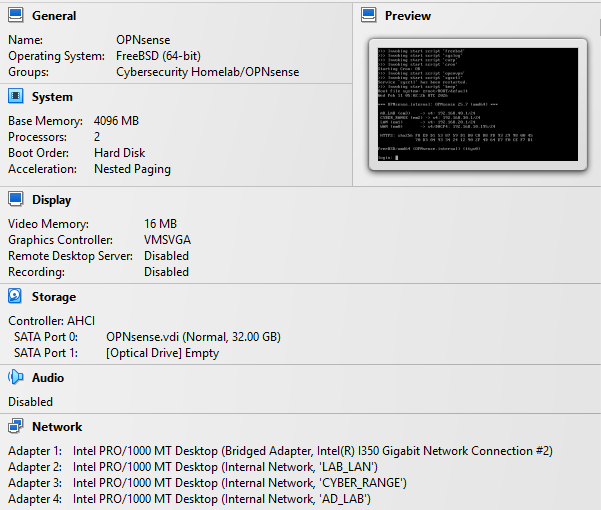
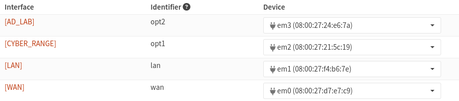
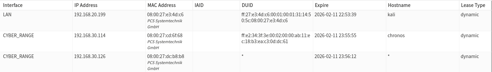
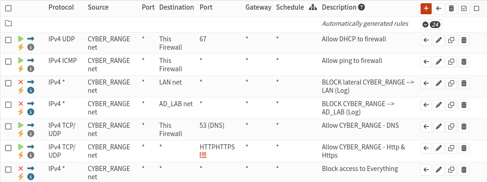

# Part 2 — Network Segmentation & Firewall Policy 

## Description

Part 2 focuses on implementing true zone-based segmentation inside the SOC-in-a-Box Homelab using OPNsense as a multi-interface firewall.

This phase establishes deterministic routing, stable DHCP per segment, enforced inter-zone access control, and controlled egress filtering. It validates that lateral movement paths can be blocked and logged — preparing the environment for SIEM ingestion in Part 3.

This is where the homelab transitions from a flat test network into an enterprise-style zone-based architecture.

---

## Architecture Goal (Zone-Based Segmentation)

Instead of relying on hypervisor VLAN tagging, segmentation is implemented using one OPNsense interface per zone:

- WAN (upstream)
- LAN (attacker / operator network)
- CYBER_RANGE (vulnerable targets)
- AD_LAB (Windows domain segment)

This approach:

- Creates clear Layer 3 boundaries
- Simplifies troubleshooting
- Enforces explicit policy control
- Mirrors enterprise firewall zone design

Show VirtualBox screenshots (OPNsense adapters)

---

## Segments & Addressing

| Segment      | Purpose                              | Subnet            | Gateway         |
|-------------|---------------------------------------|-------------------|-----------------|
| WAN         | Upstream / Internet                   | 192.168.10.0/24   | (DHCP upstream) |
| LAN         | Attacker / Operator (Kali)            | 192.168.20.0/24   | 192.168.20.1    |
| CYBER_RANGE | Vulnerable targets (Chronos, MSF)     | 192.168.30.0/24   | 192.168.30.1    |
| AD_LAB      | AD + Windows endpoints (staged)       | 192.168.40.0/24   | 192.168.40.1    |

---

## Objectives

- Implement zone-based segmentation across lab networks
- Assign persistent OPNsense interfaces (WAN/LAN/CYBER_RANGE/AD_LAB)
- Enable DHCP per zone
- Connect VMs to correct VirtualBox Internal Networks
- Enforce inter-zone access control
- Implement controlled outbound filtering
- Log denied lateral movement for SOC visibility
- Validate stability across reboots

---

## Environment Summary

### Firewall / Router
- OPNsense (VirtualBox)
- Interfaces:
  - WAN → em0 (DHCP upstream)
  - LAN → em1 (192.168.20.1/24)
  - CYBER_RANGE → em2 (192.168.30.1/24)
  - AD_LAB → em3 (192.168.40.1/24)

> Important: Interface order was explicitly validated to prevent adapter drift across reboots. WAN remains Adapter 1 to ensure persistent mapping.

Show OPNsense screenshots (Interface Assignments)

---

### VirtualBox Networks (Internal Networks)

- `LAB_LAN` → LAN
- `CYBER_RANGE` → CYBER_RANGE
- `AD_LAB` → AD_LAB

Each zone uses a dedicated Internal Network to simulate physical segmentation.

---

### VMs

- Kali (LAN) — attacker / operator node
- Chronos (CYBER_RANGE) — vulnerable Linux target
- Metasploitable (CYBER_RANGE) — vulnerable Linux target

---

## Implementation Steps

### 1) Interface Assignment & Persistence Fix

Initial segmentation caused DHCP failure (169.254.x.x on Kali).

Root Cause:
VirtualBox adapter order mismatch caused WAN/LAN interface drift.

Resolution:
- Powered off OPNsense
- Reordered adapters in VirtualBox:
  - Adapter 1 → WAN (Bridged)
  - Adapter 2 → LAN (Internal)
  - Adapter 3 → CYBER_RANGE
  - Adapter 4 → AD_LAB
- Reassigned interfaces in OPNsense console
- Rebooted and validated persistence

Segmentation is now stable across reboots.

Show OPNsense Interface Assignment

  

---

### 2) DHCP Per Zone

Enabled DHCP:

- LAN → supports Kali
- CYBER_RANGE → supports Chronos + Metasploitable

Validated leases:

- Kali → 192.168.20.x
- Chronos → 192.168.30.x
- Metasploitable → 192.168.30.x

Show DHCP leases

---

## Firewall Policy (Key Deliverable)

### CYBER_RANGE Secure Policy

The CYBER_RANGE zone represents exploitable hosts.  
Policy is designed for containment + controlled egress.

Rule Order (Top → Bottom):

1️⃣ Allow DHCP to firewall  
- CYBER_RANGE → This Firewall (UDP/67)

2️⃣ Allow ICMP to firewall  
- CYBER_RANGE → This Firewall (ICMP)

3️⃣ Block CYBER_RANGE → LAN (LOG ENABLED)  
- Prevents pivot into attacker zone

4️⃣ Block CYBER_RANGE → AD_LAB (LOG ENABLED)  
- Prevents cross-zone lateral movement

5️⃣ Allow DNS outbound (53)  
- Required for realistic host behavior

6️⃣ Allow HTTP/HTTPS outbound (80/443)  
- Simulates normal web + C2 over TLS

7️⃣ Block everything else (LOG ENABLED)  
- Enforces controlled egress filtering

This creates enterprise-style outbound restrictions while preserving realistic attack simulation.

Show CYBER_RANGE firewall rules

---

## Controlled Egress Model

Instead of allowing unrestricted outbound access, CYBER_RANGE is limited to:

- DNS (53)
- HTTP (80)
- HTTPS (443)

All other outbound ports are denied and logged.

This simulates:

- Malware beaconing over HTTPS
- Payload downloads
- DNS resolution behavior
- Blocked C2 over uncommon ports

This also generates high-quality telemetry for SIEM ingestion.

---

## LAN Policy (Attacker Zone)

LAN remains permissive outbound.

Kali must be able to:

- Reach CYBER_RANGE
- Reach AD_LAB
- Reach Internet

This simulates an established attacker foothold.

IPv6 rules were reviewed to prevent unintended bypass.

---

## Troubleshooting Notes (Real Issues Encountered)

- DHCP failure after segmentation
  - Caused by interface reassignment drift
  - Fixed by reordering adapters + reassignment

- Block rules not triggering
  - Caused by rule order (first-match firewall logic)
  - Fixed by moving block rules above allow rules

- CYBER_RANGE lacked firewall reachability
  - Required explicit rule allowing traffic to "This Firewall"

These issues reinforced the importance of:

- Interface persistence
- Rule order discipline
- Clear zone definitions

---

## Validation Checklist

- [x] Kali receives LAN DHCP
- [x] CYBER_RANGE hosts receive DHCP
- [x] Interface mapping survives reboot
- [x] CYBER_RANGE cannot pivot into LAN
- [x] CYBER_RANGE cannot pivot into AD_LAB
- [x] Only 53/80/443 allowed outbound
- [x] Blocked attempts appear in Live View logs
- [x] Segmentation behavior is deterministic

---

## Learning Outcomes

- Implemented enterprise-style zone-based segmentation
- Enforced controlled outbound filtering (egress policy)
- Validated first-match firewall behavior
- Generated actionable deny logs for future SIEM ingestion
- Diagnosed interface drift and DHCP failure in a virtualized firewall environment
- Distinguished hypervisor wiring issues from Layer 3 policy issues

---

## Next (Part 3)

Part 3 will focus on SOC telemetry:

- Forward OPNsense firewall logs to SIEM (Wazuh planned)
- Deploy endpoint agents (Linux + Windows)
- Simulate exploitation from Kali → CYBER_RANGE
- Capture lateral movement attempts
- Build detection + investigation workflow
